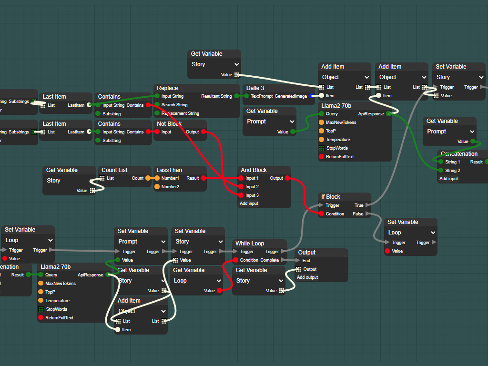
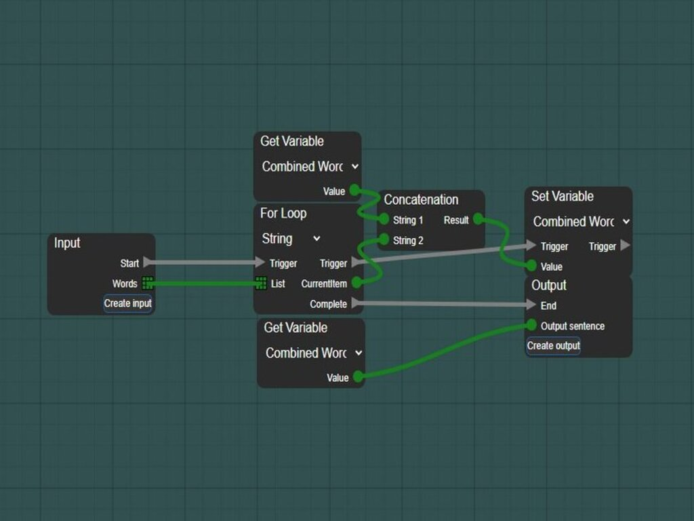
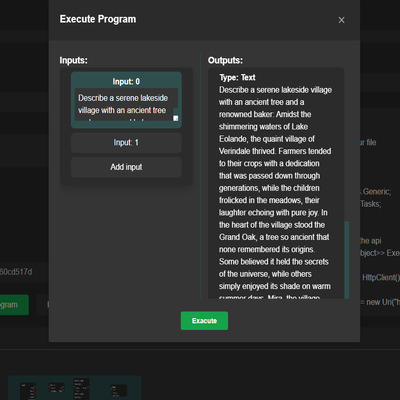
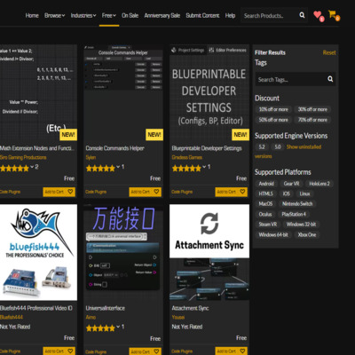

# AiDesigner (NodeNestor)

A visual node-based programming platform for building AI workflows. Originally called **NodeNestor**, this was a full SaaS product built from September 2023 to March 2024 across 259 commits — entirely before the age of AI-assisted coding.

Users connect blocks on a drag-and-drop canvas to build AI pipelines, execute them, and share them with others. Think Unreal Engine's Blueprints, but for AI.



## What it does

**Node Editor** — Drag, drop, and wire together blocks on an infinite canvas. Data flows through connections between inputs and outputs, with color-coded types (green for strings, orange for numbers, red for booleans, etc.).



**AI Blocks** — First-class blocks for LLMs (Llama 2 70B, Zephyr, Mixtral, CodeLlama), image generation (DALL-E 3), audio, and summarization, plus an OpenAI connector.

**Programming Blocks** — For loops, while loops, if/else, variables, math operations, string manipulation, list operations, logic gates — enough to build real programs visually.

**Execution** — Run programs directly in the browser with an input/output dialog. Programs can be tested in-editor or executed via API.



**Workshop / Marketplace** — Users could publish their programs for others to browse, use, and remix. Community-driven library of AI tools.



**Full SaaS** — Stripe-powered subscriptions and token purchases, user authentication with email verification and 2FA (TOTP), API access for programmatic execution.

## Architecture

```
AiDesigner/
  Client/     — Blazor WebAssembly frontend (the node editor, UI, everything visual)
  Server/     — ASP.NET Core API backend (auth, Stripe, program execution proxy, data)
  Shared/     — Shared models between client and server
```

## Tech Stack

- **C#** / **.NET 8**
- **Blazor WebAssembly** — the entire node editor runs client-side in the browser
- **ASP.NET Core** — API server with Identity for auth
- **SQL Server** + **Dapper** — data layer
- **Stripe** — subscriptions and one-time token purchases
- **Docker** — containerized deployment

## Note

This project is archived and no longer maintained. It was the precursor to the [NodeNestor organization](https://github.com/NodeNestor).

## License

MIT License — see [LICENSE](LICENSE) for details.
